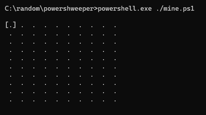

# Powershweeper

Terminal Minesweeper written in PowerShell.

Heavily inspired by this project: [https://github.com/tsoding/mine](https://github.com/tsoding/mine)

## Quick start

```console
> powershell.exe ./mine.ps1
```



## Controls

| key                                                       | description      |
| --------------------------------------------------------- | ---------------- |
| <kbd>WASD</kbd> or <kbd>&uarr; &larr; &darr; &rarr;</kbd> | Move cursor      |
| <kbd>SPACE</kbd> or <kbd>ENTER</kbd>                      | Open cell        |
| <kbd>F</kbd>                                              | Flag/unflag cell |
| <kbd>R</kbd>                                              | Restart          |
| <kbd>Q</kbd>                                              | Quit             |

## More info

The script takes three optional arguments:

**boardSize**  
Sets the width and height of the board to the specified value.  
The given value will be clamped between _5_ and _20_.

_Example:_  
`> powershell.exe ./mine.ps1 -boardSize 13`

**mineDensity**  
Sets the desired percentage of mines on the board.  
Value is clamped between _5%_ and _75%_.

_Example:_  
`> powershell.exe ./mine.ps1 -mineDensity 42`

**seed**  
When specified, the PowerShell's Get-Random method is seeded with the given value, to generate repeatable boards.

_Example:_  
`> powershell.exe ./mine.ps1 -seed 99`

**More examples:**  
When passing arguments in order their names can be skipped:  
`> powershell.exe ./mine.ps1 13 42 99`

or in arbitrary order if names preceed the values:  
`> powershell.exe ./mine.ps1 -mineDensity 42 -seed 99 -boardSize 13`

## TODOs

- Implement more efficient board drawing; only redraw changes instead of the whole board, always (that can't be good, right?),
- Add color support; draw each specific neighbor count in unique color,
- possibly more...
